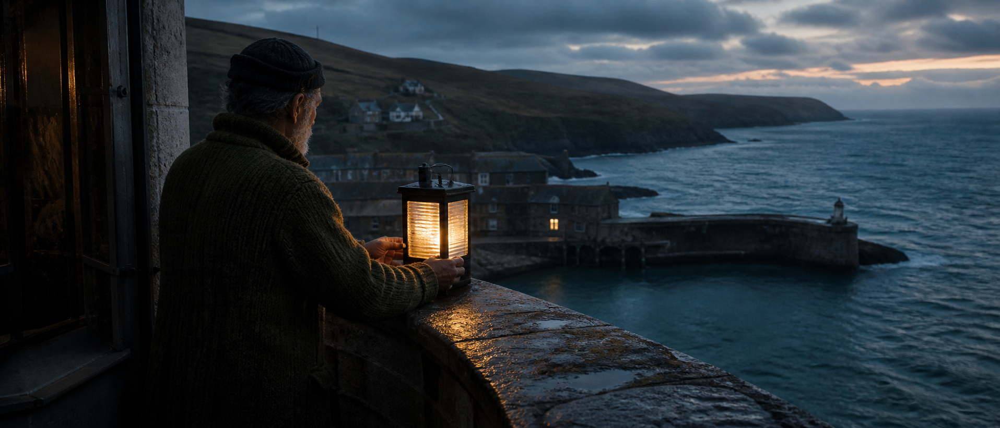
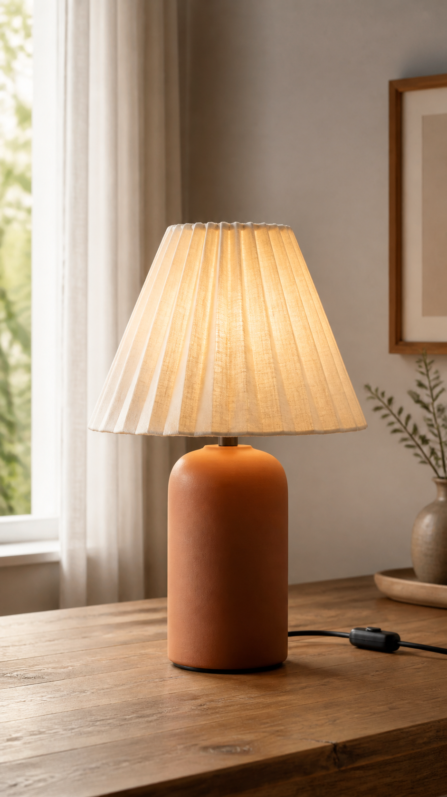
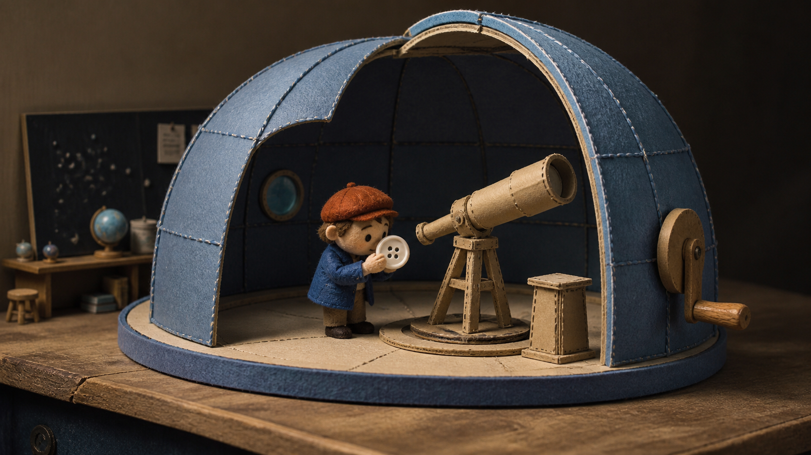
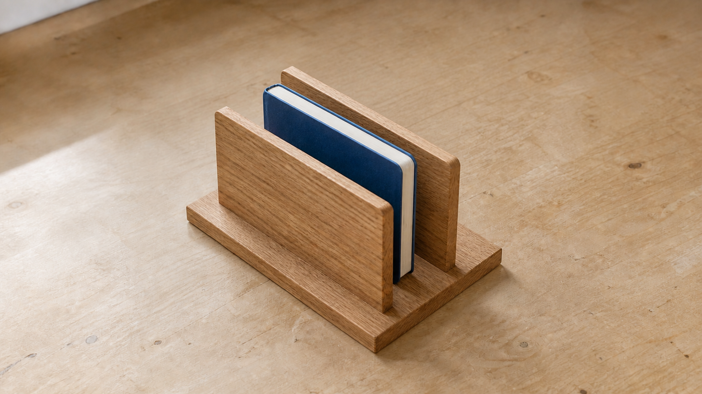
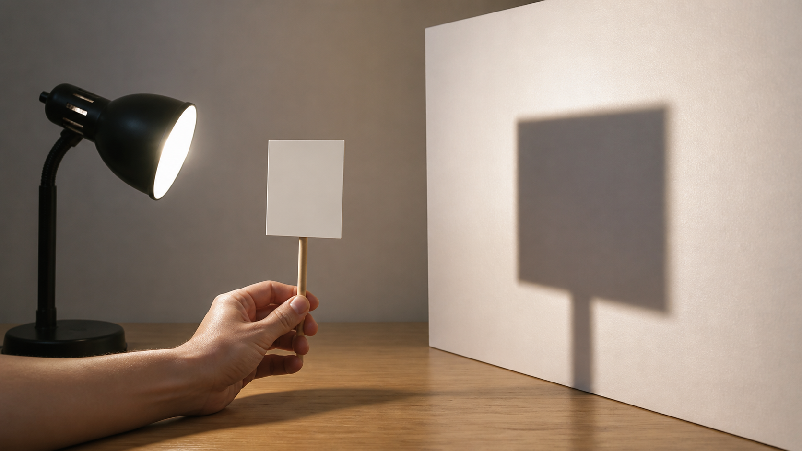
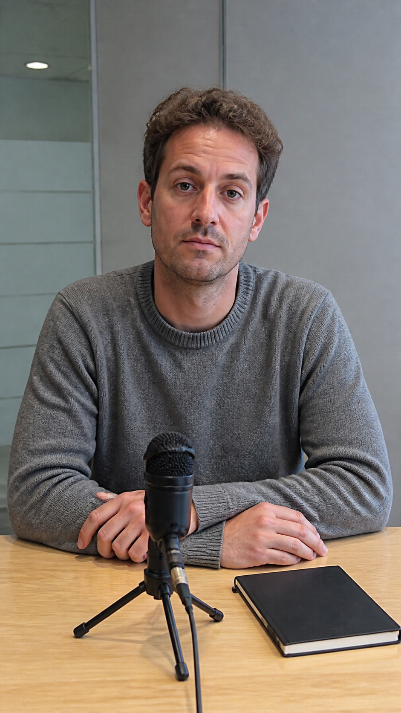

<p align="center">
  <a href="https://bestimage.ai/"></a>
</p>

# Awesome FLUX 3 Prompts

<p align="center">
  
</p>

84 complete video prompts for stories, product films, animation, education and reference-controlled scenes. Curated and maintained by the [bestimage.ai](https://bestimage.ai/) team.

[简体中文](README_zh-CN.md) · [日本語](README_ja-JP.md) · [Español](README_es-ES.md) · [Language coverage](i18n/README.md)

[](https://bestimage.ai/)
[](https://bestimage.ai/models/black-forest-labs/flux-3-text-to-video/)
[](https://bestimage.ai/models/openai/gpt-image-2/)

## Start with a scene you can direct

1. Browse the [84-prompt index](prompts/README.md) or [use-case matrix](docs/use-case-matrix.md).
2. Choose text, one approved first frame, two approved endpoints, or a source clip.
3. Copy the complete prompt block. Adjust the named variables, preserving object counts and continuity.
4. Use the [prompting guide](docs/prompting-guide.md) to review the result before extending the scene.

Use these creative specifications as starting points for your own scenes. A requested camera move, exact phrase or endpoint match is not a guaranteed output.

## Create with bestimage.ai

The bestimage.ai team maintains this independent prompt library and organizes practical image-to-video preparation and API workflows. It is not an official Black Forest Labs repository.

| Starting material | bestimage.ai entry | Purpose |
| --- | --- | --- |
| A written scene | [FLUX 3 Text to Video](https://bestimage.ai/models/black-forest-labs/flux-3-text-to-video/) | Explore a new scene, dialogue or visual explanation |
| One approved image | [FLUX 3 Image to Video](https://bestimage.ai/models/black-forest-labs/flux-3-image-to-video/) | Animate a supplied first-frame composition |
| Opening and closing images | [FLUX 3 Start/End to Video](https://bestimage.ai/models/black-forest-labs/flux-3-start-end-to-video/) | Request a controlled transition between two frames |
| An existing clip | [FLUX 3 Video Extend](https://bestimage.ai/models/black-forest-labs/flux-3-video-extend/) | Continue the source's movement, scene state and ambience |
| A storyboard or reference-frame brief | [GPT Image 2 API](https://bestimage.ai/models/openai/gpt-image-2/) | Prepare or revise **still images** before a separate video step |

GPT Image 2 is a separate image workflow, not a FLUX 3 video endpoint. Approve the image and its rights before supplying it as a video reference. Generating a useful frame does not verify the resulting video's quality.

The [12 API-oriented briefs](prompts/bestimage-api-workflows.md) map to the documented model IDs and media fields. The [integration guide](docs/bestimage-ai-flux-3-api.md) uses **`https://api.flaq.ai`, the API host for bestimage.ai**. Use an API key issued through your bestimage.ai account.

## Prompt library

| Pack | Prompts | Useful for |
| --- | ---: | --- |
| [Cinematic storytelling](prompts/cinematic-storytelling.md) | 6 | Small stories, screen geography and editorial timing |
| [Advertising & UGC](prompts/advertising-ugc.md) | 6 | Product interactions, creator content and service moments |
| [Documentary & nature](prompts/documentary-nature.md) | 6 | Synthetic editorial scenes and patient observation |
| [Animation & design](prompts/animation-design.md) | 6 | Paper, felt, clay, typography and original character motion |
| [Multilingual audio](prompts/multilingual-audio.md) | 6 | Exact dialogue, turn-taking and original vocal performance |
| [Reference workflows](prompts/reference-workflows.md) | 6 | First-frame identity, endpoints and continuity |
| [Ecommerce & product](prompts/ecommerce-product.md) | 6 | Part counts, packaging, materials and product geometry |
| [Travel & hospitality](prompts/travel-hospitality.md) | 6 | Respectful encounters, property framing and service |
| [Sports & wellness](prompts/sports-wellness.md) | 6 | Low-risk movement and inclusive community moments |
| [Education & science](prompts/education-science.md) | 6 | Small testable lessons and clear instructions |
| [Architecture & mobility](prompts/architecture-mobility.md) | 6 | Visible space, routes and logistics |
| [Social & experimental](prompts/social-experimental.md) | 6 | Deadpan humor, creator dialogue, game concepts and plates |
| [bestimage.ai API workflows](prompts/bestimage-api-workflows.md) | 12 | Three briefs for each of four documented video modes |

Each entry includes a use case, mode, timing, visible action, sound plan, invariants, exclusions and an adjustment boundary. References must have an explicit role; do not let a style image redefine an owned product or person.

## Featured prompts

Cover scene: [C01 — The lantern relay](prompts/cinematic-storytelling.md#c01): a small practical light signal introduces a fictional coastal world.

The cover and five illustrations are original static concepts, not FLUX 3 video outputs. See the [image prompts and provenance](assets/IMAGE_PROMPTS.md).

### [A01 — Light through linen](prompts/advertising-ugc.md#a01)

Preserve a lamp's geometry while one switch changes its illumination.

<p align="center">
  
</p>

```text
Animate the supplied first frame of one unbranded table lamp: pleated cream linen shade, cylindrical terracotta base and one visible black cable. Preserve its exact shape, pleat count and scale.
00:00–00:05 — Camera makes a very slow ten-degree lateral move. Afternoon light grazes the shade; the lamp itself is off. Keep the room and cable stationary.
00:05–00:10 — One adult hand enters from the lower edge and operates the existing inline switch once. Warm light begins inside the shade, with realistic transmission through linen. Exposure changes gradually.
00:10–00:15 — The hand exits along the same path. Camera eases to a stop at the approved three-quarter view. Leave the upper background clear for copy added later.
AUDIO: Quiet room, sleeve brushing the table, one small switch click. No electrical surge, music or voice.
LOCK: Same cable route, shade seam, contact shadow and tabletop texture.
AVOID: duplicated lamp, additional controls, glowing solid base, disappearing cable, energy-saving claims, generated text, logo or watermark.
```

### [N01 — The button observatory](prompts/animation-design.md#n01)

Tactile miniature storytelling with a cardboard telescope and a felt astronomer.

<p align="center">
  
</p>

```text
A tiny felt astronomer with a rust-colored cap operates a cardboard observatory on a worktable. The dome is made of stitched blue paper, and its simple telescope points through one opening. Original character and set.
00:00–00:06 — Locked miniature-wide shot. The astronomer turns a visible wooden crank. The dome moves in small tactile stop-motion increments around the fixed telescope.
00:06–00:12 — A loose white button rolls into the opening and comes to rest beside the telescope. The astronomer bends to inspect its four holes as if they were a star chart.
00:12–00:18 — The character carefully places the button on a little paper pedestal, then aims the telescope toward it. Hold the absurdly serious pose.
LOCK: Felt seams, cap shape, four button holes, telescope size and crank connection. No real human hand enters.
AUDIO: Cardboard friction, wood ticks, one button rattle and room hush. No speech or recognizable melody.
AVOID: glossy plastic, smooth live-action character motion, floating gears, real night sky replacing the tabletop, existing mascots, text or watermark.
```

### [E01 — Two dividers, one place](prompts/ecommerce-product.md#e01)

An assembly brief that keeps three product parts distinct from its notebook prop.

<p align="center">
  
</p>

```text
Show a small wooden desk organizer on a plain workbench. There are exactly three product parts: one rectangular base with two parallel slots and two identical upright dividers. An adult's hands wear no jewelry. Fixed overhead camera, soft daylight from the left.
00:00–00:05 — Show all three parts separated. The right hand picks up one divider; the left steadies the base.
00:05–00:11 — Slide that divider into the first slot until it sits flush. Insert the second divider into the second slot. No hidden cut and no additional fasteners.
00:11–00:16 — Place one closed blue notebook upright between the dividers. The notebook is a prop, not an extra organizer part.
00:16–00:20 — Withdraw both hands and hold the finished arrangement. The notebook stays supported without changing size.
AUDIO: Two soft wood contacts, paper on wood and quiet room tone. No dialogue or music.
TEXT: None.
LOCK: Same three parts, two slots, wood grain and notebook throughout.
AVOID: self-assembly, extra dividers, disappearing fingers, new screws, invented load claims, text, logos or watermark.
```

### [L01 — Move the card, not the light](prompts/education-science.md#l01)

One clear shadow demonstration with fixed light and screen.

<p align="center">
  
</p>

```text
Create a simple classroom demonstration. A small lamp on the left shines toward a vertical white screen on the right. One opaque square card stands between them on a short handle. Fixed side camera shows lamp, card and shadow together.
00:00–00:05 — Hold the initial arrangement. One adult hand grips the card handle without blocking the lamp.
00:05–00:10 — Move the card slowly closer to the lamp, along the line between lamp and screen. Its shadow on the screen becomes larger. The lamp and screen do not move.
00:10–00:15 — Stop and hold the new arrangement. The hand keeps the card steady.
NARRATION: In clear English, say exactly: "The light stays here. Moving the card closer to the light makes its shadow larger."
AUDIO: Quiet classroom beneath the narration; no music.
TEXT: None.
LOCK: One lamp, one card, one screen, constant brightness and a single consistent shadow.
AVOID: shadow shrinking during the move, multiple lights, floating card, changing screen, extra labels, logos or watermark.
```

### [X01 — One useful sentence](prompts/social-experimental.md#x01)

Exact dialogue, a five-second pause and no extra punchline.

<p align="center">
  
</p>

```text
One adult facilitator in a gray jumper sits at a plain meeting table. A small tabletop microphone and a closed notebook are the only objects. Locked phone-camera medium shot; ordinary office lighting.
00:00–00:05 — The facilitator turns the microphone on with its existing button, looks toward the camera and says in calm English, exactly: "We have time for one useful sentence."
00:05–00:10 — Hold five full seconds of sincere silence. The facilitator glances once at the closed notebook but does not open it.
00:10–00:15 — Look back up and say exactly: "That was it." Switch the microphone off and remain seated.
AUDIO: Quiet ventilation, two small button clicks and natural speech. No music, laughter or audience reaction.
TEXT: None; no automatic subtitles.
LOCK: One person, one microphone, one notebook; same face, hands, clothing and framing.
AVOID: extra dialogue, exaggerated acting, opening the notebook, new attendees, fake company branding or watermark.
```

## Model capabilities versus this integration

Black Forest Labs describes FLUX 3 as a multimodal model and documents video generation with text, image and video references, keyframes, continuation and native audio. Its video, image, action and open-weight components have distinct rollout states. Check the [official model page](https://bfl.ai/models/flux-3) and [release overview](https://bfl.ai/blog/flux-3) before relying on access or capabilities.

That broad model description does not establish that every provider exposes every input. This library's bestimage.ai workflow pack uses the four documented video modes only. In particular, a single `image_url` first frame is not a general multi-reference array.

## Language coverage

- Four landing READMEs: English, simplified Chinese, Japanese and Spanish.
- Eleven non-English scene files: Chinese, Japanese, Spanish, French, German, Korean, Brazilian Portuguese, Italian, Arabic, Russian and Indonesian.
- Each scene file translates the same three canonical scenes: X01, E01 and L01. These 33 translations are **not 33 additional original prompts**.
- The full 84-prompt collection and production guides are maintained in English. Locale files do not constitute full-library translations.

See the [language directory](i18n/README.md) for exact files and scope.

## Review before publishing a result

Use authorized reference images and consented identities and voices. Check motion, anatomy, object count, dialogue, text and first/last-frame continuity. Synthetic product demonstrations do not prove product performance; fictional venue scenes do not establish real service availability. Add business-critical copy and verified measurements in post-production.

## Contributing

Have a useful prompt, example, or translation? Read the [contribution guide](CONTRIBUTING.md) to get involved.

## About bestimage.ai

This prompt library is curated and maintained by the [bestimage.ai](https://bestimage.ai/) team, connecting practical creative workflows with image and video model APIs.

## Earn with the bestimage.ai Affiliate Program

Build tutorials, share prompts, or publish API integrations? Join the [bestimage.ai Affiliate Program](https://bestimage.ai/affiliate-program/) and earn commissions by introducing your audience to bestimage.ai.

- **20%** on a referred user's first valid paid order.
- **10%** on subsequent valid paid orders made within **60 days after that user registers**.

Order eligibility and payouts follow the [current affiliate agreement](https://bestimage.ai/affiliate-agreement/).

## License

[MIT](LICENSE).
